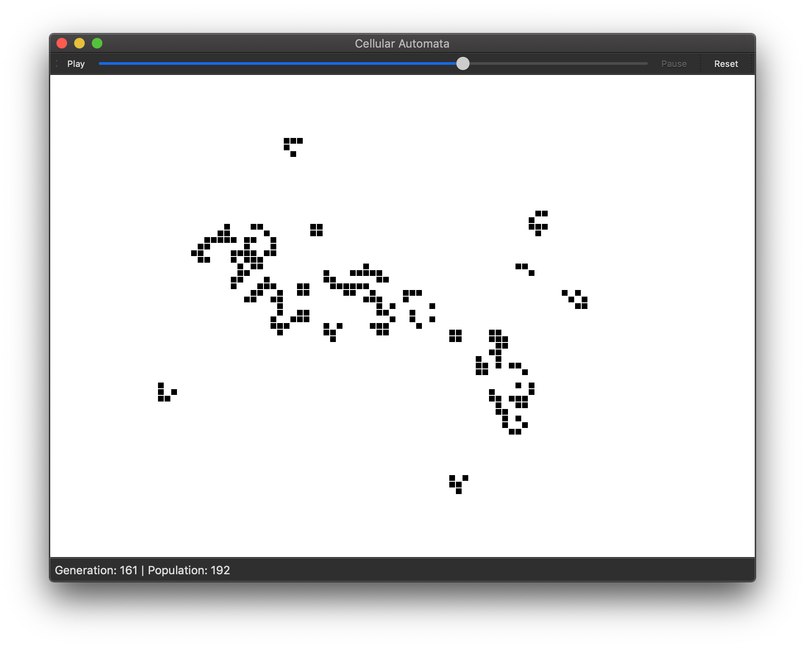
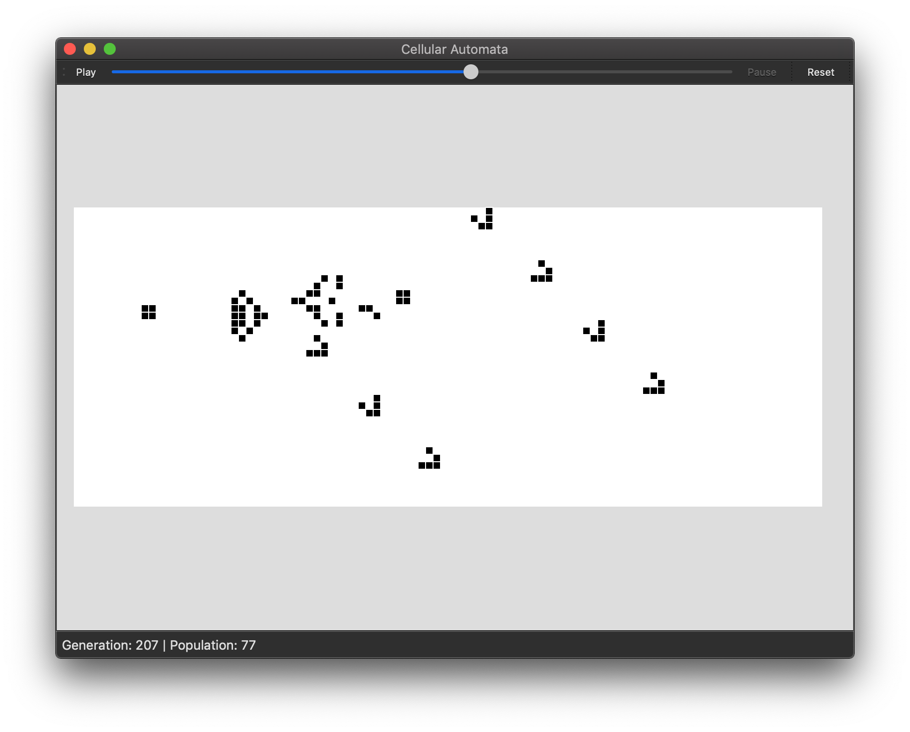

# Cellular Automata v0.1.0

This application implements Conway's Game of Life-like 2D cellular automata.

Click anywhere to place a live cell, or to toggle a live cell to a dead one. By default, the
rules are those of Conway's Game of Life. Press `N` to go to the next generation, or click `Play`
(or press the spacebar) to watch the automaton progress.

Try out new automata by changing the rules of the game. Click `Settings→Change rules...` to change
whether a cell is born or survives with certain numbers of live neighbours, or even click
`Settings→Change neighbourhood type...` to change the nature of each cell's neighbourhood.  
**Note**: after you change the neighbourhood type, you must set new rules for the automaton.

If you want to try out a cellular automaton on a non-infinite field, change the topology of the
automaton by clicking `Settings→Change topology...`. You can try out three types of topologies:
unbounded (infinite), fixed (all cells outside the board are treated as dead), and wrapping
(adjacent cells wrap around to each side). Note that this does clear the board.

Finally, avoid eye strain by changing the colour theme in the `Theme` menu; you can choose
Light, Dark, Hacker (green on black), Canadian, or Violet.
